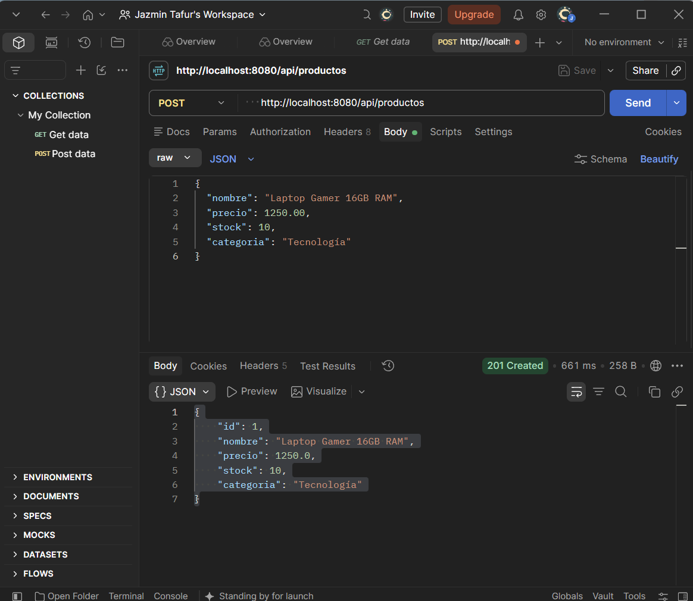
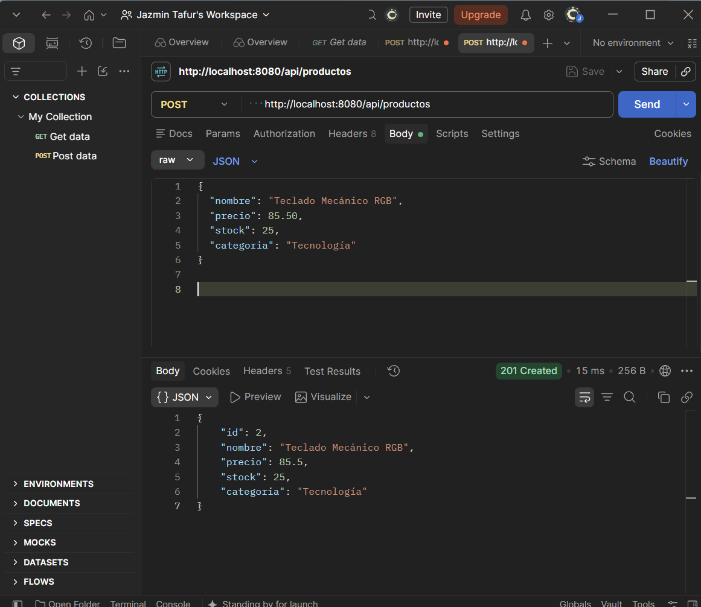
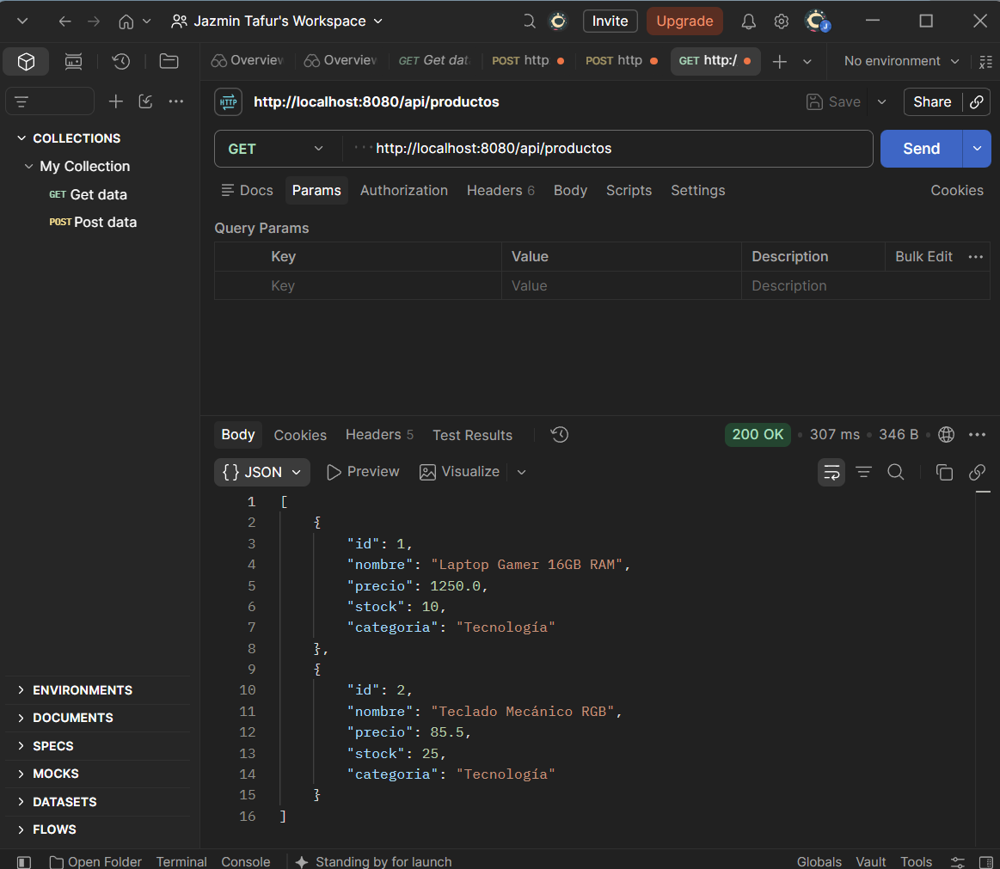
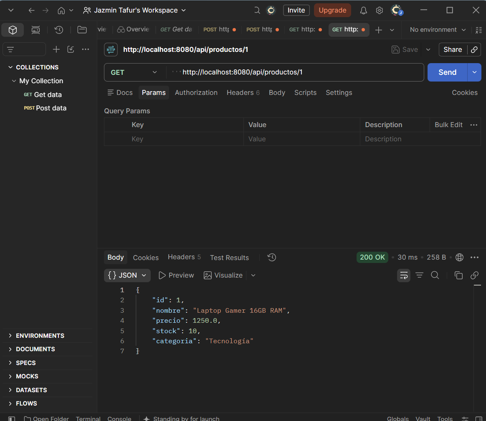
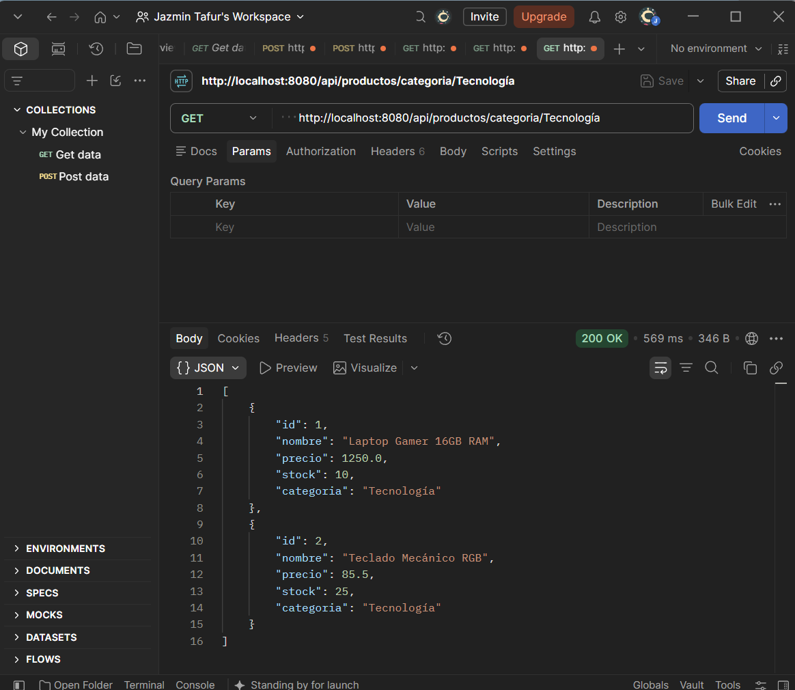
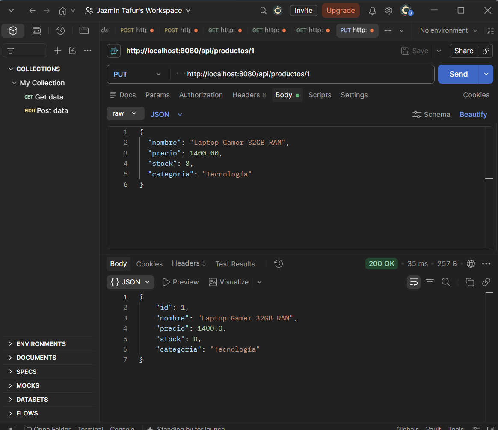
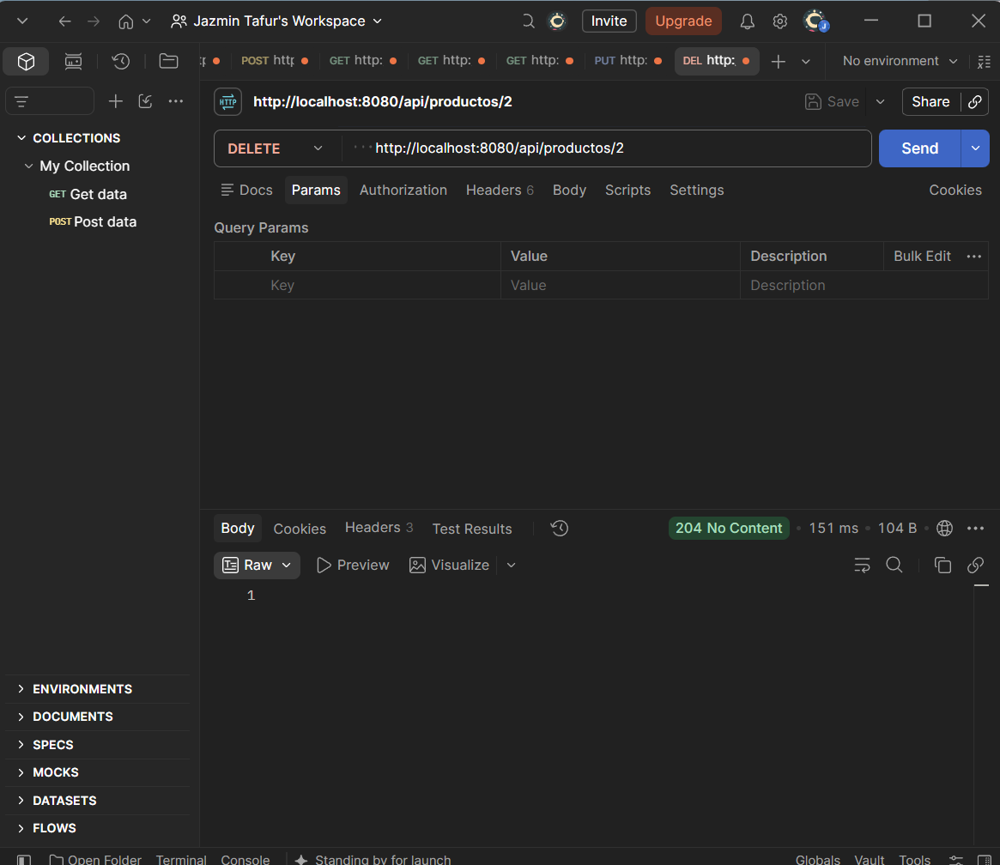

# 📦 API REST de Inventario con Spring Boot

**API REST para la gestión de productos de un inventario, construida con Spring Boot bajo arquitectura en capas**

[](https://www.oracle.com/java/)
[](https://spring.io/projects/spring-boot)
[](https://maven.apache.org/)
[](https://www.h2database.com/)
[](https://www.postman.com/)
[](https://github.com/JohanaS77/api-productos-spring-boot)

</div>

---

## 📑 Tabla de contenido

- [Descripción](#-descripción)
- [Capturas de pantalla](#-capturas-de-pantalla)
- [Funcionalidades principales](#-funcionalidades-principales)
- [Tecnologías utilizadas](#️-tecnologías-utilizadas)
- [Arquitectura del proyecto](#-arquitectura-del-proyecto)
- [Estructura del proyecto](#-estructura-del-proyecto)
- [Instalación y uso](#️-instalación-y-uso)
- [Características técnicas clave](#-características-técnicas-clave)
- [Retos evaluativos complementarios](#-retos-evaluativos-complementarios)
- [Mejoras futuras](#-mejoras-futuras)
- [Desarrolladora](#-desarrolladora)
- [Licencia](#-licencia)

---

## 📖 Descripción

**API REST de Inventario** es un proyecto backend que permite gestionar los productos de un inventario mediante operaciones **CRUD** completas (crear, consultar, actualizar y eliminar), expuestas como endpoints REST y probadas con **Postman**.

El proyecto fue desarrollado como parte de la asignatura **Desarrollo de Software Web Backend**, del programa de **Tecnología en Desarrollo de Aplicaciones Web y Móviles** de la Fundación Universitaria Compensar, aplicando el patrón de **arquitectura en capas** (Modelo, Repositorio, Servicio y Controlador) junto con **Spring Data JPA** e **Hibernate** para la persistencia de datos.

La aplicación permite:
1. **Registrar** nuevos productos indicando nombre, precio, stock y categoría.
2. **Consultar** todos los productos, uno específico por su ID, o filtrarlos por categoría.
3. **Actualizar** la información de un producto existente.
4. **Eliminar** un producto del inventario.

[⬆️ Volver arriba](#-tabla-de-contenido)

---

## 📸 Capturas de pantalla

<table align="center">
  <tr>
    <td align="center">
      <b>🟢 Crear producto 1 (POST)</b><br/>
      
    </td>
    <td align="center">
      <b>🟢 Crear producto 2 (POST)</b><br/>
      
    </td>
  </tr>
  <tr>
    <td align="center">
      <b>📋 Listar todos los productos (GET)</b><br/>
      
    </td>
    <td align="center">
      <b>🔍 Consultar producto por ID (GET)</b><br/>
      
    </td>
  </tr>
  <tr>
    <td align="center">
      <b>🏷️ Filtrar por categoría (GET)</b><br/>
      
    </td>
    <td align="center">
      <b>✏️ Actualizar producto (PUT)</b><br/>
      
    </td>
  </tr>
  <tr>
    <td align="center" colspan="2">
      <b>🗑️ Eliminar producto (DELETE)</b><br/>
      
    </td>
  </tr>
</table>

[⬆️ Volver arriba](#-tabla-de-contenido)

---

## 🚀 Funcionalidades principales

### 🗂️ Gestión completa de productos (CRUD)
- Registro de nuevos productos con validación de campos obligatorios
- Consulta de la lista completa de productos del inventario
- Consulta individual de un producto por su ID
- Filtrado de productos por categoría
- Actualización de los datos de un producto existente
- Eliminación de productos del inventario

### 🧱 Arquitectura en capas
- Separación clara de responsabilidades entre Modelo, Repositorio, Servicio y Controlador
- Uso de `JpaRepository` para las operaciones de persistencia sin necesidad de escribir SQL manual
- Lógica de negocio centralizada en la capa de Servicio, independiente del controlador

### 💾 Persistencia con base de datos en memoria
- Base de datos H2 configurada en memoria para pruebas rápidas
- Consola web de H2 habilitada para inspeccionar las tablas en tiempo real
- Generación automática del esquema de la base de datos mediante Hibernate

### 🧪 Pruebas de endpoints
- Verificación de los 7 endpoints principales mediante Postman
- Validación de los códigos de estado HTTP correspondientes a cada operación (200, 201, 204)

[⬆️ Volver arriba](#-tabla-de-contenido)

---

## 🛠️ Tecnologías utilizadas

<div align="center">

| Tecnología | Uso |
|---|---|
| Java 17 | Lenguaje de programación principal |
| Spring Boot | Framework backend para la construcción de la API |
| Spring Web | Exposición de endpoints REST |
| Spring Data JPA | Capa de persistencia y mapeo objeto-relacional |
| Hibernate | Implementación de JPA para la comunicación con la base de datos |
| H2 Database | Base de datos relacional en memoria |
| Lombok | Reducción de código repetitivo (getters, setters, constructores) |
| Maven | Gestión de dependencias y construcción del proyecto |
| Postman | Cliente HTTP para probar los endpoints |

</div>

[⬆️ Volver arriba](#-tabla-de-contenido)

---

## 🧩 Arquitectura del proyecto

<div align="center">

| Endpoint | Método | Descripción |
|---|---|---|
| `/api/productos` | GET | Lista todos los productos del inventario |
| `/api/productos/{id}` | GET | Consulta un producto específico por su ID |
| `/api/productos/categoria/{categoria}` | GET | Filtra los productos por categoría |
| `/api/productos` | POST | Crea un nuevo producto |
| `/api/productos/{id}` | PUT | Actualiza un producto existente |
| `/api/productos/{id}` | DELETE | Elimina un producto por su ID |

</div>

### Capas del proyecto

<div align="center">

| Capa | Paquete | Descripción |
|---|---|---|
| Modelo | `model` | Define la entidad `Producto` mapeada a la tabla `productos` |
| Repositorio | `repository` | Interfaz que extiende `JpaRepository` para el acceso a datos |
| Servicio | `service` | Contiene la lógica de negocio del inventario |
| Controlador | `controller` | Expone los endpoints REST y gestiona las peticiones HTTP |

</div>

[⬆️ Volver arriba](#-tabla-de-contenido)

---

## 📂 Estructura del proyecto

```
api_productos/
│
├── pom.xml
├── .gitignore
├── README.md
│
├── images/
│   ├── johana.png
│   ├── postman1.png
│   ├── postman2.png
│   ├── postman3.png
│   ├── postman4.png
│   ├── postman5.png
│   ├── postman6.png
│   └── postman7.png
│
└── src/
    └── main/
        ├── java/com/inventario/api_productos/
        │   ├── ApiProductosApplication.java
        │   ├── model/
        │   │   └── Producto.java
        │   ├── repository/
        │   │   └── ProductoRepository.java
        │   ├── service/
        │   │   └── ProductoService.java
        │   └── controller/
        │       └── ProductoController.java
        └── resources/
            └── application.properties
```

[⬆️ Volver arriba](#-tabla-de-contenido)

---

## ⚙️ Instalación y uso

### Requisitos previos
- Java JDK 17 o superior
- Maven (incluido en el proyecto mediante el Maven Wrapper)
- Un cliente HTTP como Postman

### 1. Clonar el repositorio

```bash
git clone https://github.com/JohanaS77/api-productos-spring-boot.git
cd api-productos-spring-boot
```

### 2. Ejecutar la aplicación

Desde el IDE (VS Code, IntelliJ, Eclipse, etc.), ejecuta la clase principal:

```
ApiProductosApplication.java
```

O desde la terminal, usando el Maven Wrapper:

```bash
./mvnw spring-boot:run
```

### 3. Probar los endpoints

La aplicación quedará disponible en:

```
http://localhost:8080/api/productos
```

> La consola de H2 puede consultarse en `http://localhost:8080/h2-console`, usando la URL JDBC `jdbc:h2:mem:inventariodb`.

[⬆️ Volver arriba](#-tabla-de-contenido)

---

## 🧠 Características técnicas clave

- **Arquitectura en capas** — cada capa tiene una única responsabilidad, lo que facilita el mantenimiento y la escalabilidad del proyecto.
- **`JpaRepository`** — permite realizar operaciones CRUD y consultas derivadas (como `findByCategoria`) sin necesidad de escribir sentencias SQL.
- **Lombok (`@Data`, `@NoArgsConstructor`, `@AllArgsConstructor`)** — elimina la necesidad de escribir manualmente getters, setters y constructores en la entidad.
- **`ResponseEntity`** — permite controlar de forma explícita el código de estado HTTP devuelto en cada respuesta (200, 201, 204, 404).
- **Base de datos en memoria (H2)** — agiliza las pruebas del proyecto sin necesidad de instalar un motor de base de datos externo.
- **`spring.jpa.hibernate.ddl-auto=update`** — genera y actualiza automáticamente el esquema de la base de datos a partir de la entidad `Producto`.

[⬆️ Volver arriba](#-tabla-de-contenido)

---

## 🎯 Retos evaluativos complementarios

- [ ] Implementar una consulta personalizada `findByPrecioLessThan` para filtrar productos por precio
- [ ] Crear un endpoint `PATCH` en `/api/productos/{id}/reducir-stock` para reducir el stock, validando disponibilidad
- [ ] Sustituir la base de datos H2 por un motor persistente como MySQL o PostgreSQL

[⬆️ Volver arriba](#-tabla-de-contenido)

---

## 🔮 Mejoras futuras

- [ ] Agregar validaciones con `@Valid` y mensajes de error personalizados
- [ ] Implementar manejo global de excepciones con `@ControllerAdvice`
- [ ] Documentar la API con Swagger / OpenAPI
- [ ] Agregar paginación en el listado de productos
- [ ] Migrar a una base de datos persistente en producción
- [ ] Añadir pruebas unitarias con JUnit y Mockito

[⬆️ Volver arriba](#-tabla-de-contenido)

---

## 👩‍💻 Desarrolladora

<div align="center">

<br/><br/>
<b>Johana Saavedra</b><br/>
Estudiante de Ingeniería de Software

</div>

Este proyecto fue desarrollado de manera individual por **Johana Jazmín Saavedra Tafur**, estudiante de sexto semestre de la **Tecnología en Desarrollo de Aplicaciones Web y Móviles** en la Fundación Universitaria Compensar, como parte de la asignatura **Desarrollo de Software Web Backend**.

[⬆️ Volver arriba](#-tabla-de-contenido)

---

## 📜 Licencia

Este proyecto es de código abierto y está disponible bajo la Licencia MIT.

[⬆️ Volver arriba](#-tabla-de-contenido)
